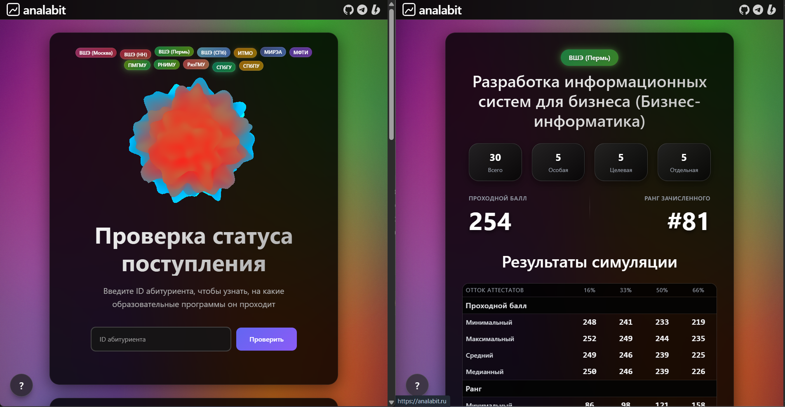
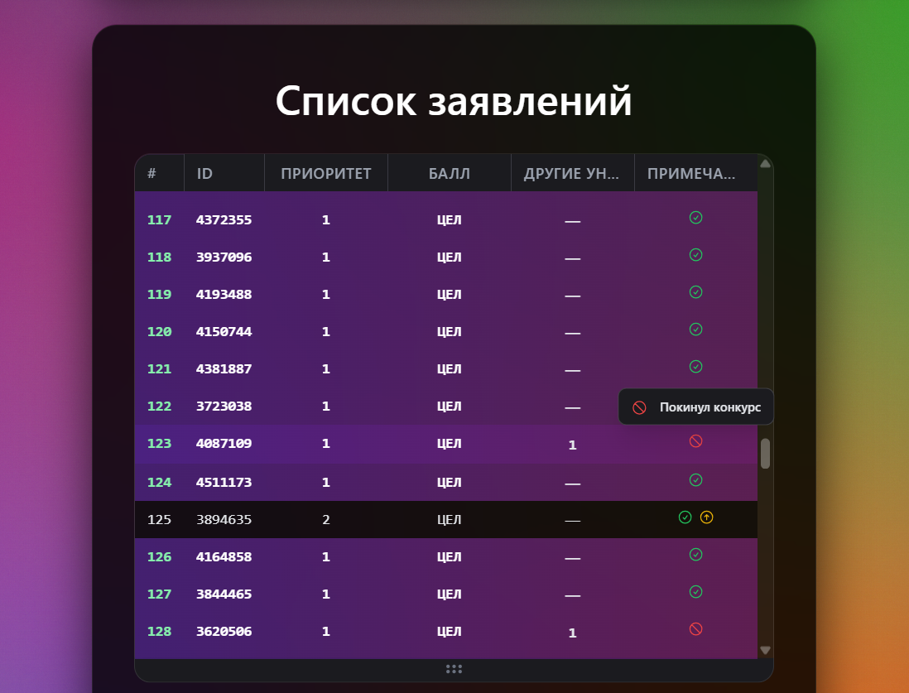
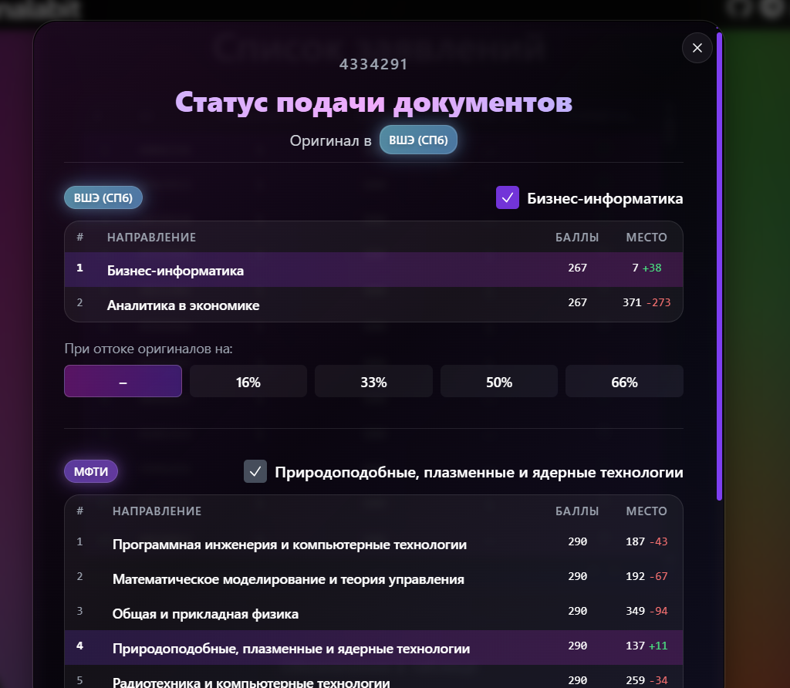

# analabit Web UI

This is the Next.js web interface for the missing anal_ytics service for abiturients. It is only the UI layer for interacting with the backend, built on top of the analabit core.

**Core (analabit) repository:** https://github.com/trueegorletov/analabit

## Showcase

License: See `LICENSE`.
